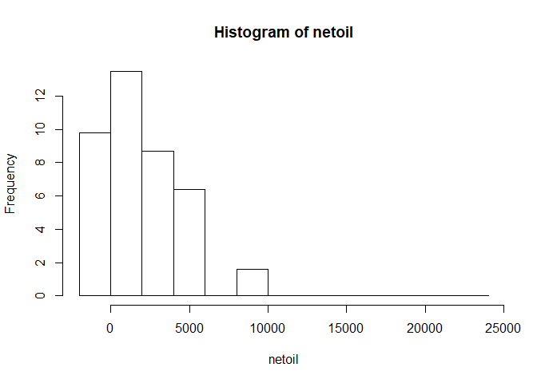

# Data Book


```r
# tibble allows to compress the output of a dataset when printing
library(tibble)

dataset <- read.csv("2007_welltest.csv", stringsAsFactors = FALSE)
as.tibble(dataset)   # small output
#>: # A tibble: 13,414 x 113
#>:    PRODUCTION_DAY            CODE OBJECT_START_DATE OBJECT_END_DATE
#>:             <chr>           <chr>             <chr>           <chr>
#>:  1     10/02/2007 MFEH-A002S02-TS        26/10/2006                
#>:  2     22/01/2007 MFEH-A002S02-TS        26/10/2006                
#>:  3     20/12/2007 MFEH-A002S02-TS        26/10/2006                
#>:  4     02/10/2007 MFEH-A002S02-TS        26/10/2006                
#>:  5     04/09/2007 MFEH-A002S02-TS        26/10/2006                
#>:  6     06/08/2007 MFEH-A002S02-TS        26/10/2006                
#>:  7     16/07/2007 MFEH-A002S02-TS        26/10/2006                
#>:  8     09/06/2007 MFEH-A002S02-TS        26/10/2006                
#>:  9     15/05/2007 MFEH-A002S02-TS        26/10/2006                
#>: 10     17/04/2007 MFEH-A002S02-TS        26/10/2006                
#>: # ... with 13,404 more rows, and 109 more variables: WELL_CLASS <chr>,
#>: #   WELL_TYPE <chr>, PROD_METHOD <chr>, PUMP_TYPE <chr>,
#>: #   WELL_METER_FREQ <chr>, INSTRUMENTATION_TYPE <int>, ALLOC_FLAG <chr>,
#>: #   COND_AS_OIL_FLAG <chr>, CHOKE_UOM <chr>, CGR_METHOD <chr>,
#>: #   CALC_SEQ_NO <int>, CAN_PROC_OIL <chr>, CAN_PROC_GAS <chr>,
#>: #   CAN_PROC_WAT <chr>, CAN_PROC_GASLIFT <chr>, CAN_PROC_CO2 <chr>,
#>: #   CAN_PROC_GASINJ <chr>, CAN_PROC_WATINJ <chr>, CAN_PROC_STEAMINJ <chr>,
#>: #   CAN_PROC_COND <chr>, CAN_PROC_DILUENT <chr>, CALC_DC_SEQ_NO <int>,
#>: #   ISPRODUCER <chr>, ISPRODUCEROROTHER <chr>, ISINJECTOR <chr>,
#>: #   ISOTHER <chr>, ISNOTOTHER <chr>, ISOILPRODUCER <chr>,
#>: #   ISGASPRODUCER <chr>, ISCONDENSATEPRODUCER <chr>,
#>: #   ISWATERPRODUCER <chr>, ISGASINJECTOR <chr>, ISWATERINJECTOR <chr>,
#>: #   ISAIRINJECTOR <chr>, ISSTEAMINJECTOR <chr>, ISWASTEINJECTOR <chr>,
#>: #   ISCO2INJECTOR <chr>, OP_IND <chr>, GP_IND <chr>, WP_IND <chr>,
#>: #   CP_IND <chr>, GL_IND <chr>, DL_IND <chr>, WI_IND <chr>, GI_IND <chr>,
#>: #   SI_IND <chr>, CI_IND <chr>, WELL_HOLE_CODE <chr>, OP_AREA_CODE <chr>,
#>: #   OP_SUB_AREA_CODE <chr>, OP_FCTY_1_CODE <chr>, DAYTIME <chr>,
#>: #   Z_WELL_TYPE <chr>, Z_WELL_TEST_TYPE <chr>, END_DATE <chr>,
#>: #   DURATION_HRS <dbl>, VALID_FROM_DATE <chr>, STATUS <chr>,
#>: #   USE_CALC_IND <chr>, PRIMARY_IND <chr>, FLOWING_IND <chr>,
#>: #   CHOKE_SIZE <dbl>, Z_SEP_PRESS_PSIG <dbl>, Z_SEP_PRESS_BARG <dbl>,
#>: #   Z_SEP_TEMP_C <dbl>, Z_SEP_TEMP_F <dbl>, WH_PRESS_PSIG <dbl>,
#>: #   WH_PRESS_BARG <dbl>, ANNULUS_PRESS_PSIG <dbl>,
#>: #   ANNULUS_PRESS_BARG <dbl>, WH_USC_PRESS_PSIG <dbl>,
#>: #   WH_USC_PRESS_BARG <dbl>, WH_USC_TEMP_C <dbl>, WH_USC_TEMP_F <dbl>,
#>: #   WH_DSC_PRESS_PSIG <dbl>, WH_DSC_PRESS_BARG <dbl>, GL_CHOKE_SIZE <dbl>,
#>: #   GL_RATE_SCFPERDAY <dbl>, GL_RATE_SM3PERDAY <dbl>,
#>: #   GL_RATE_MSCFPERDAY <dbl>, RATE_SOURCE <chr>,
#>: #   Z_TOTAL_GAS_SCFPERDAY <dbl>, Z_TOTAL_GAS_SM3PERDAY <dbl>,
#>: #   Z_TOTAL_GAS_MSCFPERDAY <dbl>, TOT_WATER_RATE_ADJ_BBLSPERDAY <dbl>,
#>: #   TOT_WATER_RATE_ADJ_M3PERDAY <dbl>, NET_COND_RATE_ADJ_BBLSPERDAY <dbl>,
#>: #   NET_COND_RATE_ADJ_SM3PERDAY <dbl>, GAS_RATE_ADJ_SCFPERDAY <dbl>,
#>: #   GAS_RATE_ADJ_SM3PERDAY <dbl>, GAS_RATE_ADJ_MSCFPERDAY <dbl>,
#>: #   NET_OIL_RATE_ADJ_BBLSPERDAY <dbl>, NET_OIL_RATE_ADJ_SM3PERDAY <dbl>,
#>: #   LIQUID_RATE_ADJ_BBLSPERDAY <dbl>, LIQUID_RATE_ADJ_SM3PERDAY <dbl>,
#>: #   GOR_SCFPERBBL <dbl>, Z_FGOR_SCFPERBBL <dbl>, WOR <dbl>,
#>: #   Z_IGLR_SCFPERBBL <dbl>, Z_TGLR_SCFPERBBL <dbl>, ...
```


```r
# show all the columns 
names(dataset)
#>:   [1] "PRODUCTION_DAY"                "CODE"                         
#>:   [3] "OBJECT_START_DATE"             "OBJECT_END_DATE"              
#>:   [5] "WELL_CLASS"                    "WELL_TYPE"                    
#>:   [7] "PROD_METHOD"                   "PUMP_TYPE"                    
#>:   [9] "WELL_METER_FREQ"               "INSTRUMENTATION_TYPE"         
#>:  [11] "ALLOC_FLAG"                    "COND_AS_OIL_FLAG"             
#>:  [13] "CHOKE_UOM"                     "CGR_METHOD"                   
#>:  [15] "CALC_SEQ_NO"                   "CAN_PROC_OIL"                 
#>:  [17] "CAN_PROC_GAS"                  "CAN_PROC_WAT"                 
#>:  [19] "CAN_PROC_GASLIFT"              "CAN_PROC_CO2"                 
#>:  [21] "CAN_PROC_GASINJ"               "CAN_PROC_WATINJ"              
#>:  [23] "CAN_PROC_STEAMINJ"             "CAN_PROC_COND"                
#>:  [25] "CAN_PROC_DILUENT"              "CALC_DC_SEQ_NO"               
#>:  [27] "ISPRODUCER"                    "ISPRODUCEROROTHER"            
#>:  [29] "ISINJECTOR"                    "ISOTHER"                      
#>:  [31] "ISNOTOTHER"                    "ISOILPRODUCER"                
#>:  [33] "ISGASPRODUCER"                 "ISCONDENSATEPRODUCER"         
#>:  [35] "ISWATERPRODUCER"               "ISGASINJECTOR"                
#>:  [37] "ISWATERINJECTOR"               "ISAIRINJECTOR"                
#>:  [39] "ISSTEAMINJECTOR"               "ISWASTEINJECTOR"              
#>:  [41] "ISCO2INJECTOR"                 "OP_IND"                       
#>:  [43] "GP_IND"                        "WP_IND"                       
#>:  [45] "CP_IND"                        "GL_IND"                       
#>:  [47] "DL_IND"                        "WI_IND"                       
#>:  [49] "GI_IND"                        "SI_IND"                       
#>:  [51] "CI_IND"                        "WELL_HOLE_CODE"               
#>:  [53] "OP_AREA_CODE"                  "OP_SUB_AREA_CODE"             
#>:  [55] "OP_FCTY_1_CODE"                "DAYTIME"                      
#>:  [57] "Z_WELL_TYPE"                   "Z_WELL_TEST_TYPE"             
#>:  [59] "END_DATE"                      "DURATION_HRS"                 
#>:  [61] "VALID_FROM_DATE"               "STATUS"                       
#>:  [63] "USE_CALC_IND"                  "PRIMARY_IND"                  
#>:  [65] "FLOWING_IND"                   "CHOKE_SIZE"                   
#>:  [67] "Z_SEP_PRESS_PSIG"              "Z_SEP_PRESS_BARG"             
#>:  [69] "Z_SEP_TEMP_C"                  "Z_SEP_TEMP_F"                 
#>:  [71] "WH_PRESS_PSIG"                 "WH_PRESS_BARG"                
#>:  [73] "ANNULUS_PRESS_PSIG"            "ANNULUS_PRESS_BARG"           
#>:  [75] "WH_USC_PRESS_PSIG"             "WH_USC_PRESS_BARG"            
#>:  [77] "WH_USC_TEMP_C"                 "WH_USC_TEMP_F"                
#>:  [79] "WH_DSC_PRESS_PSIG"             "WH_DSC_PRESS_BARG"            
#>:  [81] "GL_CHOKE_SIZE"                 "GL_RATE_SCFPERDAY"            
#>:  [83] "GL_RATE_SM3PERDAY"             "GL_RATE_MSCFPERDAY"           
#>:  [85] "RATE_SOURCE"                   "Z_TOTAL_GAS_SCFPERDAY"        
#>:  [87] "Z_TOTAL_GAS_SM3PERDAY"         "Z_TOTAL_GAS_MSCFPERDAY"       
#>:  [89] "TOT_WATER_RATE_ADJ_BBLSPERDAY" "TOT_WATER_RATE_ADJ_M3PERDAY"  
#>:  [91] "NET_COND_RATE_ADJ_BBLSPERDAY"  "NET_COND_RATE_ADJ_SM3PERDAY"  
#>:  [93] "GAS_RATE_ADJ_SCFPERDAY"        "GAS_RATE_ADJ_SM3PERDAY"       
#>:  [95] "GAS_RATE_ADJ_MSCFPERDAY"       "NET_OIL_RATE_ADJ_BBLSPERDAY"  
#>:  [97] "NET_OIL_RATE_ADJ_SM3PERDAY"    "LIQUID_RATE_ADJ_BBLSPERDAY"   
#>:  [99] "LIQUID_RATE_ADJ_SM3PERDAY"     "GOR_SCFPERBBL"                
#>: [101] "Z_FGOR_SCFPERBBL"              "WOR"                          
#>: [103] "Z_IGLR_SCFPERBBL"              "Z_TGLR_SCFPERBBL"             
#>: [105] "Z_GUF_SCFPERBBL"               "WATERCUT_PCT"                 
#>: [107] "DRY_WET_GAS_RATIO"             "WGR_BBLPERSCF"                
#>: [109] "CGR_BBLPERSCF"                 "RESULT_NO"                    
#>: [111] "RECORD_STATUS"                 "CREATED_DATE"                 
#>: [113] "LAST_UPDATED_DATE"
```


```r
# get only the numeric columns
nums <- sapply(dataset, is.numeric)
numdf <- dataset[, nums]
names(numdf)
#>:  [1] "INSTRUMENTATION_TYPE"          "CALC_SEQ_NO"                  
#>:  [3] "CALC_DC_SEQ_NO"                "DURATION_HRS"                 
#>:  [5] "CHOKE_SIZE"                    "Z_SEP_PRESS_PSIG"             
#>:  [7] "Z_SEP_PRESS_BARG"              "Z_SEP_TEMP_C"                 
#>:  [9] "Z_SEP_TEMP_F"                  "WH_PRESS_PSIG"                
#>: [11] "WH_PRESS_BARG"                 "ANNULUS_PRESS_PSIG"           
#>: [13] "ANNULUS_PRESS_BARG"            "WH_USC_PRESS_PSIG"            
#>: [15] "WH_USC_PRESS_BARG"             "WH_USC_TEMP_C"                
#>: [17] "WH_USC_TEMP_F"                 "WH_DSC_PRESS_PSIG"            
#>: [19] "WH_DSC_PRESS_BARG"             "GL_CHOKE_SIZE"                
#>: [21] "GL_RATE_SCFPERDAY"             "GL_RATE_SM3PERDAY"            
#>: [23] "GL_RATE_MSCFPERDAY"            "Z_TOTAL_GAS_SCFPERDAY"        
#>: [25] "Z_TOTAL_GAS_SM3PERDAY"         "Z_TOTAL_GAS_MSCFPERDAY"       
#>: [27] "TOT_WATER_RATE_ADJ_BBLSPERDAY" "TOT_WATER_RATE_ADJ_M3PERDAY"  
#>: [29] "NET_COND_RATE_ADJ_BBLSPERDAY"  "NET_COND_RATE_ADJ_SM3PERDAY"  
#>: [31] "GAS_RATE_ADJ_SCFPERDAY"        "GAS_RATE_ADJ_SM3PERDAY"       
#>: [33] "GAS_RATE_ADJ_MSCFPERDAY"       "NET_OIL_RATE_ADJ_BBLSPERDAY"  
#>: [35] "NET_OIL_RATE_ADJ_SM3PERDAY"    "LIQUID_RATE_ADJ_BBLSPERDAY"   
#>: [37] "LIQUID_RATE_ADJ_SM3PERDAY"     "GOR_SCFPERBBL"                
#>: [39] "Z_FGOR_SCFPERBBL"              "WOR"                          
#>: [41] "Z_IGLR_SCFPERBBL"              "Z_TGLR_SCFPERBBL"             
#>: [43] "Z_GUF_SCFPERBBL"               "WATERCUT_PCT"                 
#>: [45] "DRY_WET_GAS_RATIO"             "WGR_BBLPERSCF"                
#>: [47] "CGR_BBLPERSCF"                 "RESULT_NO"
```


```r
# get only the non-numeric columns
nums <- sapply(dataset, is.numeric)
nonumdf <- dataset[, !nums]
names(nonumdf)
#>:  [1] "PRODUCTION_DAY"       "CODE"                 "OBJECT_START_DATE"   
#>:  [4] "OBJECT_END_DATE"      "WELL_CLASS"           "WELL_TYPE"           
#>:  [7] "PROD_METHOD"          "PUMP_TYPE"            "WELL_METER_FREQ"     
#>: [10] "ALLOC_FLAG"           "COND_AS_OIL_FLAG"     "CHOKE_UOM"           
#>: [13] "CGR_METHOD"           "CAN_PROC_OIL"         "CAN_PROC_GAS"        
#>: [16] "CAN_PROC_WAT"         "CAN_PROC_GASLIFT"     "CAN_PROC_CO2"        
#>: [19] "CAN_PROC_GASINJ"      "CAN_PROC_WATINJ"      "CAN_PROC_STEAMINJ"   
#>: [22] "CAN_PROC_COND"        "CAN_PROC_DILUENT"     "ISPRODUCER"          
#>: [25] "ISPRODUCEROROTHER"    "ISINJECTOR"           "ISOTHER"             
#>: [28] "ISNOTOTHER"           "ISOILPRODUCER"        "ISGASPRODUCER"       
#>: [31] "ISCONDENSATEPRODUCER" "ISWATERPRODUCER"      "ISGASINJECTOR"       
#>: [34] "ISWATERINJECTOR"      "ISAIRINJECTOR"        "ISSTEAMINJECTOR"     
#>: [37] "ISWASTEINJECTOR"      "ISCO2INJECTOR"        "OP_IND"              
#>: [40] "GP_IND"               "WP_IND"               "CP_IND"              
#>: [43] "GL_IND"               "DL_IND"               "WI_IND"              
#>: [46] "GI_IND"               "SI_IND"               "CI_IND"              
#>: [49] "WELL_HOLE_CODE"       "OP_AREA_CODE"         "OP_SUB_AREA_CODE"    
#>: [52] "OP_FCTY_1_CODE"       "DAYTIME"              "Z_WELL_TYPE"         
#>: [55] "Z_WELL_TEST_TYPE"     "END_DATE"             "VALID_FROM_DATE"     
#>: [58] "STATUS"               "USE_CALC_IND"         "PRIMARY_IND"         
#>: [61] "FLOWING_IND"          "RATE_SOURCE"          "RECORD_STATUS"       
#>: [64] "CREATED_DATE"         "LAST_UPDATED_DATE"
```


```r
# show only the ID descriptive variables
library(dplyr)

dataset %>%
    select(CODE, WELL_HOLE_CODE, OP_SUB_AREA_CODE, OP_AREA_CODE, OP_FCTY_1_CODE) %>%
    head
#>:              CODE WELL_HOLE_CODE OP_SUB_AREA_CODE OP_AREA_CODE
#>: 1 MFEH-A002S02-TS      MFEH-A002             MFEH        NORTH
#>: 2 MFEH-A002S02-TS      MFEH-A002             MFEH        NORTH
#>: 3 MFEH-A002S02-TS      MFEH-A002             MFEH        NORTH
#>: 4 MFEH-A002S02-TS      MFEH-A002             MFEH        NORTH
#>: 5 MFEH-A002S02-TS      MFEH-A002             MFEH        NORTH
#>: 6 MFEH-A002S02-TS      MFEH-A002             MFEH        NORTH
#>:   OP_FCTY_1_CODE
#>: 1      MFEH-DP-A
#>: 2      MFEH-DP-A
#>: 3      MFEH-DP-A
#>: 4      MFEH-DP-A
#>: 5      MFEH-DP-A
#>: 6      MFEH-DP-A
```


```r
# the physical well is called a HOLE
# a HOLE can have two strings: LS and SS
# a nominal well will be ANY-A0001-LS and another
# well ANY-A0001-SS. Both belong to a HOLE
# 
# How many holes in this dataset?
length(unique(dataset$WELL_HOLE_CODE))
#>: [1] 743
# unique(dataset$WELL_HOLE_CODE)
```


```r
# how many nominal wells
length(unique(dataset$CODE))
#>: [1] 995
```


```r
# how many fields
length(unique(dataset$OP_SUB_AREA_CODE))
#>: [1] 41
unique(dataset$OP_SUB_AREA_CODE)
#>:  [1] "MFEH" "NMPO" "EZOH" "BOEH" "TPUH" "QVMJ" "SFTL" "BCV"  "LFQH" "UJOH"
#>: [11] "CFLL" "UHHJ" "MVLO" "QOBS" "BOTJ" "EVMH" "UNCH" "FCSX" "TNSH" "TNEL"
#>: [21] "LOSU" "CZBO" "TNSL" "EE46" "UNOB" "EE29" "CBLV" "CBSN" "CFUZ" "CSOC"
#>: [31] "CPLS" "CSOB" "MUHX" "TJXB" "UVLB" "NN44" "NN22" "CC23" "CC22" "BTNQ"
#>: [41] "TDTD"
```


```r
# how many operating units
length(unique(dataset$OP_AREA_CODE))
#>: [1] 3
unique(dataset$OP_AREA_CODE)
#>: [1] "NORTH" "EAST"  "SOUTH"
```


```r
# how many platforms
length(unique(dataset$OP_FCTY_1_CODE))
#>: [1] 103
unique(dataset$OP_FCTY_1_CODE)
#>:   [1] "MFEH-DP-A"   "NMPO-DP-A"   "EZOH-DP-A"   "EZOH-DP-B"   "BOEH-DP-A"  
#>:   [6] "TPUH-DP-A"   "EZOH-DP-C"   "QVMJ-PS-NAG" "QVMJ-DP-A"   "SFTL-DP-A"  
#>:  [11] "BCV-DP-A"    "LFQH-DP-A"   "UJOH-DP-A"   "CFLL-DP-A"   "CFLL-PS-NAG"
#>:  [16] "CFLL-DP-C"   "UHHJ-DP-A"   "CFLL-DP-B"   "MVLO-DP-A"   "QOBS-DP-A"  
#>:  [21] "BOTJ-DP-A"   "BOTJ-DP-C"   "EVMH-DP-A"   "UJOH-DP-B"   "BOTJ-DP-E"  
#>:  [26] "BOTJ-DP-B"   "EVMH-DP-B"   "EVMH-DP-C"   "EVMH-DP-D"   "UNCH-DP-B"  
#>:  [31] "FCSX-DP-A"   "UNCH-DP-A"   "TNSH-DP-A"   "TNEL-DP-A"   "TNSH-DP-B"  
#>:  [36] "FCSX-DP-B"   "LOSU-DP-A"   "TNSH-JT-D"   "TNSH-JT-C"   "CZBO-DP-B"  
#>:  [41] "CZBO-DP-D"   "CZBO-DP-A"   "CZBO-DP-C"   "TNSH-JT-G"   "TNSL-PS-A"  
#>:  [46] "TNSH-JT-E"   "TNSH-JT-F"   "EE46-DP-B"   "UNOB-DP-A"   "EE46-DP-A"  
#>:  [51] "UNOB-DP-B"   "UNOB-JT-C"   "EE46-JT-C"   "EE29-DP-A"   "EE29-JT-C"  
#>:  [56] "EE29-JT-B"   "CBLV-JT-A"   "UNOB-DP-E"   "UNOB-JT-T"   "CBSN-DP-A"  
#>:  [61] "UNOB-JT-CC"  "UNOB-JT-W"   "CBSN-DP-B"   "CBSN-JT-D"   "CBSN-DP-C"  
#>:  [66] "CBSN-DP-E"   "CFUZ-DP-A"   "CSOC-PS-B"   "CBSN-JT-H"   "CBSN-JT-F"  
#>:  [71] "CBSN-DP-G"   "CPLS-DP-A"   "CPLS-DP-B"   "CPLS-DP-C"   "CSOB-DP-A"  
#>:  [76] "CSOB-DP-B"   "CSOB-JT-C"   "CSOB-JT-E"   "CSOB-JT-D"   "CSOB-DP-J"  
#>:  [81] "CSOB-DP-I"   "CSOB-JT-H"   "CSOB-JT-F"   "MUHX-DP-A"   "MUHX-WJ-4"  
#>:  [86] "MUHX-DP-B"   "MUHX-DP-C"   "TJXB-MP-A"   "UVLB-DP-A"   "UVLB-WJ-3"  
#>:  [91] "UVLB-DP-B"   "UVLB-JT-C"   "UVLB-JT-D"   "UVLB-JT-E"   "UVLB-JT-G"  
#>:  [96] "UVLB-JT-F"   "NN44-DP-A"   "NN22-DP-A"   "CC23-MP-A"   "UVLB-JT-H"  
#>: [101] "CC22-MP-A"   "RSAU-DP-A"   "TDTD-DP-A"
```


```r
dataset <- read.csv("2007_welltest.csv", stringsAsFactors = FALSE)
```


`PRODUCTION_DAY`: date that the measurement was taken.

`CODE`: nominal well. In the case of dual wells, it is one of the strings, teh short or the long.

`WELL_HOLE_CODE`: the physical well that is drilled. A hole or physical well could have two nominal wells. See `CODE`.

`WELL_TYPE`:   

        Gas Producer
        Oil Producer
        Gas Producer Cond
        Water Injector

```r
unique(dataset$WELL_TYPE)
#>: [1] "GP"  "OP"  "GP2" "WI"
```

`PROD_METHOD`: How the well produces.
    Natural Flow
    Gas Lift
    Pumping Unit
    

```r
unique(dataset$PROD_METHOD)
#>: [1] ""   "NF" "GL" "C"  "PU"
```


`WELL_CLASS`: Producer or Injector.


```r
unique(dataset$WELL_CLASS)
#>: [1] "P" "I"
```

`DURATION_HRS`: duration of the test


```r
dur <- sort(unique(round(dataset$DURATION_HRS, 0))) # rounding, unique, sort
dur
#>:  [1]    0    1    2    3    4    5    6    7    8    9   10   11   12   13
#>: [15]   14   15   16   17   18   19   20   21   22   23   24   25   26   27
#>: [29]   28   29   30   32   34   38   40   41   42   43   44   45   46   47
#>: [43]   48   49   50   51   65   68   70   71   72   88   92   93   96  114
#>: [57]  115  116  117  119  121  138  144  156  242  244  696  720  726  748
#>: [71]  763  766  767 1468 5251
```


```r
# interval analysis of test durantion
table(cut(dataset$DURATION_HRS, breaks = c(0, 1, 2, 4, 6, 12, 24, 48, 72)))
#>: 
#>:   (0,1]   (1,2]   (2,4]   (4,6]  (6,12] (12,24] (24,48] (48,72] 
#>:     208    1261    5456     915     386    4926      94      25
```


`STATUS`: What happens with the well test.

```r
unique(dataset$STATUS)
#>: [1] "ACCEPTED" "REJECTED" "NEW"
```

`NET_OIL_RATE_ADJ_BBLSPERDAY`: Net oil produced in STB/DAY


```r
summary(dataset$NET_OIL_RATE_ADJ_BBLSPERDAY)
#>:     Min.  1st Qu.   Median     Mean  3rd Qu.     Max.     NA's 
#>:     -4.3    110.1    289.5    542.8    600.4 410353.9      819

# which wells are higher than 10,000 BOPD
lmask <- dataset$NET_OIL_RATE_ADJ_BBLSPERDAY > 10000
imask <- which(lmask)

value = dataset$NET_OIL_RATE_ADJ_BBLSPERDAY[imask]
well  = dataset$CODE[imask]

data.frame(index = imask, well = well, NetOil = value)
#>:   index            well    NetOil
#>: 1  1593 CFLL-A007S01-TS  10582.81
#>: 2  2888    BOTJ-E003-LS  22009.15
#>: 3  3107    BOTJ-E010-SS  16446.82
#>: 4  4579    EVMH-A027-LS  44252.38
#>: 5  4959    EVMH-C013-TS 410353.94
```


```r
# remove the two highest reading. They belong to a tank battery
netoil <- dataset$NET_OIL_RATE_ADJ_BBLSPERDAY[-c(4579,4959)]
summary(netoil)
#>:     Min.  1st Qu.   Median     Mean  3rd Qu.     Max.     NA's 
#>:    -4.32   110.02   289.50   506.80   600.11 22009.15      819
```


```r
# interval analysis of oil production
table(cut(dataset$NET_OIL_RATE_ADJ_BBLSPERDAY, 
          breaks = c(0, 50, 100, 250, 500, 1000, 2000, 4000, 8000, 10000)))
#>: 
#>:        (0,50]      (50,100]     (100,250]     (250,500]   (500,1e+03] 
#>:          1004          1038          2792          3039          2251 
#>: (1e+03,2e+03] (2e+03,4e+03] (4e+03,8e+03] (8e+03,1e+04] 
#>:          1091           406            84             3
```


```r
# histogram of net oil
hist.data = hist(netoil, plot=F)   # do not plot. 
# log-transform the counts: 2^2, 2^4, ... 2^10 = 1024
hist.data$counts[hist.data$counts>0] <- log(hist.data$counts[hist.data$counts>0], 2)
plot(hist.data)
```



WATERCUT_PCT

```r
summary(dataset$WATERCUT_PCT)
#>:     Min.  1st Qu.   Median     Mean  3rd Qu.     Max.     NA's 
#>:    0.000    0.045   40.000   41.481   72.000 6000.000     1261
```


```r
# values that are above 100 watercut
mask  <- dataset$WATERCUT_PCT > 100
value <- dataset$WATERCUT_PCT[which(dataset$WATERCUT_PCT > 100)]

# wells and watercuts that abnormal
well <- dataset$CODE[which(dataset$WATERCUT_PCT > 100)]
data.frame(well = well, watercut = value)
#>:              well watercut
#>: 1 TNSH-B042S01-LS      810
#>: 2    BTNQ-A001-LS     1584
#>: 3    BTNQ-A001-LS     1856
#>: 4    BTNQ-A001-LS     1500
#>: 5    BTNQ-A001-SS     4000
#>: 6    BTNQ-A001-SS     6000
```


```r
library(tibble)
# what wells have NAs 
lmask <- is.na(dataset$WATERCUT_PCT)
imask <- which(lmask)

value <- dataset$WATERCUT_PCT[imask]
well  <- dataset$CODE[imask]

as.tibble(data.frame(well = well, watercut = value))
#>: # A tibble: 1,261 x 2
#>:               well watercut
#>:             <fctr>    <dbl>
#>:  1 MFEH-A002S02-TS       NA
#>:  2 MFEH-A002S02-TS       NA
#>:  3 MFEH-A002S02-TS       NA
#>:  4    NMPO-A002-SS       NA
#>:  5 NMPO-A003S07-TS       NA
#>:  6    NMPO-A004-SS       NA
#>:  7    NMPO-A004-SS       NA
#>:  8    NMPO-A004-SS       NA
#>:  9    NMPO-A004-SS       NA
#>: 10    NMPO-A004-SS       NA
#>: # ... with 1,251 more rows
```


```r
# interval analysis of watercut
table(cut(dataset$WATERCUT_PCT, 
          breaks = c(0, 10, 25, 50, 80, 90, 95, 100)))
#>: 
#>:   (0,10]  (10,25]  (25,50]  (50,80]  (80,90]  (90,95] (95,100] 
#>:     1265      986     1907     3010     1153      513      435

# histogram of only those wells that have watercut < 100
hist(dataset$WATERCUT_PCT[which(!dataset$WATERCUT_PCT > 100)])
```


#### Logical process status of a well
These are character-boolean variables: "Y" or "N".

```r
unique(dataset$CAN_PROC_STEAMINJ)
#>: [1] "N"
unique(dataset$CAN_PROC_WATINJ)
#>: [1] "N"
```


     [15] "CALC_SEQ_NO"                   "CAN_PROC_OIL"                 
     [17] "CAN_PROC_GAS"                  "CAN_PROC_WAT"                 
     [19] "CAN_PROC_GASLIFT"              "CAN_PROC_CO2"                 
     [21] "CAN_PROC_GASINJ"               "CAN_PROC_WATINJ"              
     [23] "CAN_PROC_STEAMINJ"             "CAN_PROC_COND"                
     [25] "CAN_PROC_DILUENT"


#### Logical production status of a well
These are character-boolean variables: "Y" or "N".

     [27] "ISPRODUCER"                    "ISPRODUCEROROTHER"            
     [29] "ISINJECTOR"                    "ISOTHER"                      
     [31] "ISNOTOTHER"                    "ISOILPRODUCER"                
     [33] "ISGASPRODUCER"                 "ISCONDENSATEPRODUCER"         
     [35] "ISWATERPRODUCER"               "ISGASINJECTOR"                
     [37] "ISWATERINJECTOR"               "ISAIRINJECTOR"                
     [39] "ISSTEAMINJECTOR"               "ISWASTEINJECTOR"              
     [41] "ISCO2INJECTOR" 


```r
unique(dataset$ISINJECTOR)
#>: [1] "N" "Y"
unique(dataset$ISGASINJECTOR)
#>: [1] "N"
unique(dataset$ISPRODUCEROROTHER)
#>: [1] "Y" "N"
unique(dataset$ISWASTEINJECTOR)
#>: [1] "N"
```

